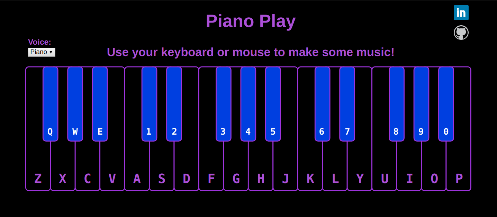

# Piano Play

* [Piano Play Live Site](https://amandamitchell707.github.io/PianoPlay/)

## Screenshot


## Overview
* Welcome to Piano Play! Anyone can be a musician. This app allows users to play around on the piano and make some music!
* Piano play displays a piano on the screen, and the user can play the piano with their keyboard or mouse.
* Users can set the voice of the keyboard to either piano or cello.

## Architecture and Technologies
* Javascript for overall structure and logic
* webpack to bundle files

## Code Samples
* HTML elements for all piano keys and audio files are created using JavaScript.

```javascript
function setupWhiteKeys(dataKeys) {
    let keyContainer = document.getElementById('piano');

    for (let i = 0; i < 18; i++) {
      keyContainer.appendChild(createWhiteKey(dataKeys[i], i));
    }
  }


  function setupBlackKeys(dataKeys, xValues) {
      let keyContainer = document.getElementById('piano');
      for (let i = 0; i < 13; i++) {
          keyContainer.appendChild(createBlackKey(dataKeys[i + 18], xValues[i]));
      }
  }

  function setupAudioTags(dataKeys, notes) {
    let audioContainer = document.createElement('div');
    audioContainer.className = 'audio-tags';

    for (let i = 0; i < dataKeys.length; i++) {
      audioContainer.appendChild(createAudioTag(dataKeys[i], notes[i], voices[0]));
      audioContainer.appendChild(createAudioTag(dataKeys[i], notes[i], voices[1]));
    }

    let body = document.querySelector('body');
    body.appendChild(audioContainer);
  }
```

* Piano keys are labeled with corresponding keys on the keyboard. When the cooresponding keyboard key is pressed, the piano key lights up and the audio file with the appropriate note and keyboard voice plays.

```javascript
 window.addEventListener('keydown', (e) => {
    let audio;
    if (sessionStorage.voice === 'classic') {
      audio = document.querySelectorAll(`audio[data-key="${e.keyCode}"]`)[0];
    } else {
      audio = document.querySelectorAll(`audio[data-key="${e.keyCode}"]`)[1];
    }
    const key = document.querySelector(`.key[data-key="${e.keyCode}"]`);
    if (audio === undefined) return;
    if (keyEnabledHash[e.keyCode] == undefined || keyEnabledHash[e.keyCode]) {
      keyEnabledHash[e.keyCode] = false;
      audio.currentTime = 0;
      audio.play();
      key.classList.add("playing");
    }
  });
```
